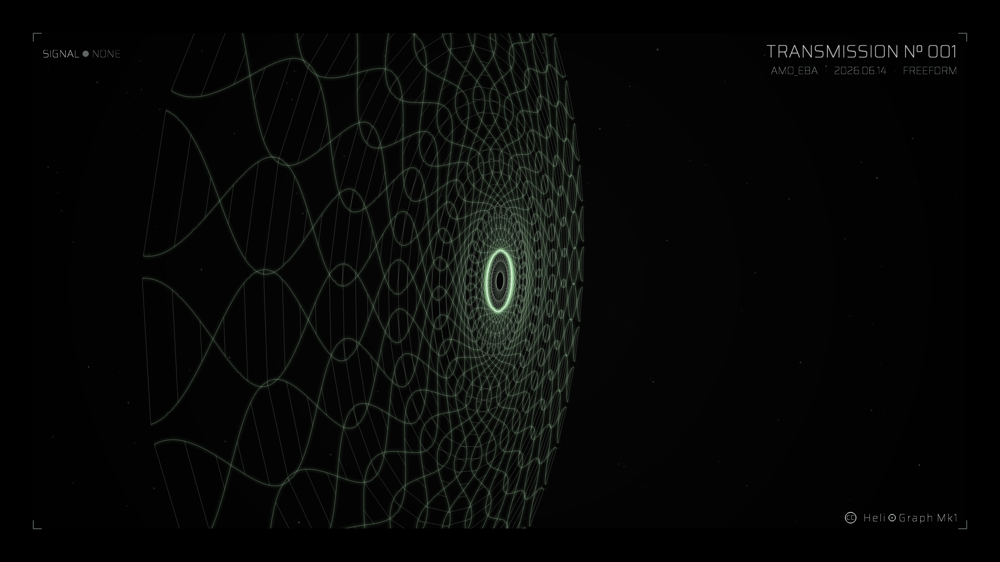

# heliograph

An audio-reactive broadcast visualizer written in C++ on [openFrameworks](https://openframeworks.cc/) 0.12.1.
It captures whatever audio is playing on the system (via a loopback device), analyses it in real time,
renders a reactive visualizer with a broadcast-style HUD over a deep-space background, and records the
result to a single 1440p MP4 ready for upload.

The renderer is built on **visualSynthesizerOrigins**, the visualSynth matrix/grid engine from
[i5hi/openFrameworksProjects](https://github.com/i5hi/openFrameworksProjects/tree/master/visualSynthesizerOrigins).

> This file is a technical overview. For dependency install, per-platform build steps, audio-routing
> setup, controls, and release packaging, see **[`app/README.md`](app/README.md)**.



> **This is exactly how a recording looks.** The control panels are hidden here — toggle them with
> **`G`**. They're drawn to the screen only and are **never captured** in the video (see
> [Render pipeline](#render-pipeline)), so you can leave them off for a clean frame or open them
> mid-recording without anything showing up in the MP4.

---

## What it is

A single-window, real-time desktop application:

- **Language / framework:** C++ on openFrameworks 0.12.1, core only — `addons.make` is empty, no addons.
- **Graphics:** OpenGL 2.1 (legacy pipeline, chosen so wide GL lines render correctly), GLFW window.
- **Window:** fixed 2560×1440, 16:9, 60 fps, vsync on, non-resizable.
- **External dependency:** `ffmpeg` (invoked as a subprocess for encoding/muxing).
- **Source:** three files — `app/src/main.cpp`, `app/src/ofApp.h`, `app/src/ofApp.cpp`.
- **Platforms:** macOS, Linux, Windows. The `src/` is portable; codec, subprocess, and path
  differences are handled with `#ifdef` at compile time.

## What it does

1. Captures system / DAW audio from a virtual **loopback** input device.
2. Runs an FFT + band/energy analysis and derives level, bass/mid/high envelopes, a beat envelope,
   and the primary sub-frequency (pitch).
3. Drives a reactive visualizer — concentric **radial** rings, a **grid** matrix, or a **double helix** —
   over a drifting starfield, framed by a broadcast HUD with live, auto-generated telemetry.
4. Records the rendered frame + the captured audio to one muxed **1440p H.264 / AAC MP4**.
5. Persists session metadata and visual presets to `~/.heliograph/`.

The on-screen control panels are deliberately drawn **after** the recorded frame is finalised, so they
are visible live but never captured — settings can be edited mid-recording without appearing in the video.

---

## How it works

### Audio capture
`setupAudio()` enumerates `ofSoundStream` devices and auto-selects a loopback input by name
(`blackhole`, `cable`, `vb-audio`, `voicemeeter`, `loopback`, `monitor`, `jack`), falling back to the
first available input. It requests 48 kHz / 512-frame buffers, then adopts the device's actual sample
rate. `audioIn()` runs on the audio thread: it mono-sums each frame into a circular buffer
(`ringBuf`, `N = 2048`) under a `std::mutex`, tracks RMS, and — while recording — appends the
interleaved samples (as 16-bit `short`) to `recAudio`.

### Signal analysis (DSP)
Each frame, `update()` copies the ring buffer under lock and runs `computeFFT()` — a self-contained
iterative radix-2 FFT with a Hann window, producing `N/2` magnitude bins. The spectrum is peak-held
then eased (`lerp 0.16`) for smooth decay. From it:

- **Bands:** the lower `N/4` bins are folded into a band array with a treble tilt (high bands react
  more), peak-held with a configurable trail (`cfgRate`) — these drive the rings/grid/helix.
- **Energy envelopes:** `energy(loHz, hiHz, gain)` integrates a frequency range; `level` (RMS),
  `bass` (30–180 Hz), `mid` (180–2000 Hz), and `high` (1.8–15 kHz) are each smoothed by an
  attack/release `Env`.
- **Beat:** a bass-transient test (`bInst > prevBass·1.35`) fires `beatEnv`, which decays over ~0.45 s.
- **Pitch / heading:** when bass is present, a normalised autocorrelation search over ~38–320 Hz
  finds the dominant period (more accurate than coarse FFT bins at low pitch). The result becomes
  `subFreq` (Hz, smoothed) and a note letter `subNote` — surfaced in the HUD as **HDG**.

### Visualizer
The scene (`drawScene`) composites a gradient space background (`drawSpace`), 200 slowly drifting
stars (`drawStars`), and the visualizer (additive blended). There are two **layouts**, toggled at
runtime:

- **RADIAL** (`drawPortal`) — concentric reactive rings; sub-modes orbit / triangle / square, plus
  the **helix** (`drawHelix`, a rotating audio-reactive double helix).
- **GRID** (`drawGrid`) — the visualSynth matrix: an X/Y grid of cells with per-column/row translate,
  twist, pinch, shift, scale, and a line-width falloff curve.

Each layout owns an independent `LayoutState` (appearance, colour, spin, camera rates + manual angle,
audio-reactive flags, and its full modulation setup), so RADIAL and GRID keep separate settings.
A legacy fractal-tree `drawForest` exists in the source but is disabled.

### Render pipeline
The scene + HUD render into `fboFinal`, a 2560×1440 RGBA FBO with 4× MSAA, clipped to an inset frame
via `glScissor`. That FBO is blitted to the window through `displayRect()`, which letterboxes to
preserve 16:9 at any window/fullscreen size. The control panels, parameter-help cards, shortcut
overlay, and REC indicator are drawn to the screen **after** `fboFinal` is finalised — mapped into FBO
space but never composited into the recorded frame.


### Modulation
Two modulation banks, **AUDIO MOD** and **LFO MOD**, each with up to 3 slots (`ModSlot`). A slot binds
a destination parameter and rides its value from a base toward a target, driven either by audio
amplitude or a sine LFO (default rate derived from the Schumann resonance, 7.83 Hz, octave-shifted).
A parameter can be modulated by only one slot; modulation is part of per-layout state and applied each
frame in `applyMods()`.

### HUD & telemetry
`drawHud()` renders the broadcast overlay: a Channel wordmark + Episode number, the session
Title/Note, and a telemetry strip. Telemetry is auto-generated and not user-editable: **date** (system
date), **waypoint** (randomised per session), **HDG** (detected sub-frequency as bearing + note), and
**DIST** (seconds recorded). The HUD also shows **SIGNAL** state: `NONE` (no audio) / `AUDITION`
(audio present) / `LIVE` (audio + recording).

### Recording
`startRecording()` opens an `ffmpeg` subprocess via `popen` and pipes raw RGBA frames
(`-f rawvideo`, 1440p, 30 fps) to a temporary video file. Video frame timing is locked to wall-clock
(`recFrames` vs `(t - recStart)·30`), duplicating frames to catch up if a frame runs long, so video
stays in sync with the real-time audio. Captured audio is written to a scratch WAV on stop, then
`stopRecording()` muxes video + audio into one MP4 (`-c:v copy -c:a aac -b:a 320k`) and deletes the
temporaries. Filenames are composed from the session fields (artifact + shorthand + episode + artist);
re-recording the same name prompts before overwriting. The video encoder is selected at compile time:
VideoToolbox (GPU) on macOS, `libx264` (CPU) elsewhere.

### Configuration & persistence
All user data lives in `~/.heliograph/` (portable, not in the repo):

- `session.json` — session metadata (channel, episode, artist, title, note, movement, recordings dir).
- `presets/*.json` — saved visual looks; each preset stores a layout's full appearance + camera angle.

On first launch the app seeds `~/.heliograph/` from the factory `data/` shipped in the build
(idempotent — existing user files are never overwritten). Recordings go to a chosen folder's
`HelioRecordings/` subfolder, or the OS videos directory by default (`~/Movies`, `~/Videos`,
`%USERPROFILE%\Videos`).

### Cross-platform abstraction
Platform differences are isolated at the top of `ofApp.cpp`:

- **Video codec:** `GS_VCODEC` → VideoToolbox (`__APPLE__`) vs `libx264`.
- **ffmpeg path:** probed at common Homebrew/system locations on macOS (GUI apps don't inherit the
  shell `PATH`); from `PATH` on Linux/Windows.
- **Subprocess:** `popen`/`pclose` vs `_popen`/`_pclose`.
- **Home / videos dirs:** `HOME` vs `USERPROFILE`, `$XDG_VIDEOS_DIR`, `~/Movies`.
- **Loopback device:** matched by name across BlackHole / VB-Cable / VoiceMeeter / PulseAudio monitor / JACK.
- **macOS `.app`:** if `data/` is copied into `Contents/Resources/`, the data root is repointed there
  so the bundle is self-contained.

---

## Tech stack

| Component | Choice |
|---|---|
| Language | C++ |
| Framework | openFrameworks 0.12.1 (core only, no addons) |
| Graphics | OpenGL 2.1, GLFW |
| Window / render | 2560×1440 @ 60 fps; 4× MSAA FBO; letterboxed blit |
| DSP | custom radix-2 FFT (Hann window, N=2048) + autocorrelation pitch detection |
| Encoding | ffmpeg subprocess — H.264 (VideoToolbox / libx264) + AAC 320k, 1440p30 MP4 |
| Font | Saira (variable), bundled in `bin/data/fonts/` |

## Project layout

```
heliograph/
├── app/
│   ├── src/
│   │   ├── main.cpp        # window + GL setup, .app data-root handling, run loop
│   │   ├── ofApp.h         # app class, structs, the live-defaults "TWEAK ZONE"
│   │   └── ofApp.cpp       # audio, DSP, visualizer, render, modulation, HUD, recording
│   ├── bin/data/           # bundled assets: fonts, factory presets, factory session.json (seeds ~/.heliograph/)
│   ├── addons.make         # empty — core openFrameworks only
│   ├── config.make         # openFrameworks build config
│   ├── Makefile            # oF make wrapper (Linux/Windows)
│   └── README.md           # install / build / run / controls guide
├── assets/                 # screenshots used in this README
├── .github/workflows/      # release.yml — builds + attaches prebuilt binaries on GitHub Release
└── LICENSE                 # MIT
```

## Build & run

Summarised here; full per-platform instructions, dependencies, and audio routing are in
**[`app/README.md`](app/README.md)**.

- **Dependencies:** openFrameworks 0.12.1, a C++ toolchain (Xcode / `g++` + `make` / Visual Studio),
  `ffmpeg`, and a loopback audio device (BlackHole / VB-Cable / PulseAudio monitor).
- **Build:** place `app/` in `<OF>/apps/myApps/heliograph/`, then build via Xcode (macOS) or
  regenerate the project with the oF `projectGenerator` and `make` (Linux/Windows).
- **Run:** launch the binary in `bin/`, route system/DAW audio to the loopback device, and play audio —
  the visualizer reacts. Press `H` in-app for the controls overlay.

## License

MIT © 2026 i5hi — see [`LICENSE`](LICENSE).
